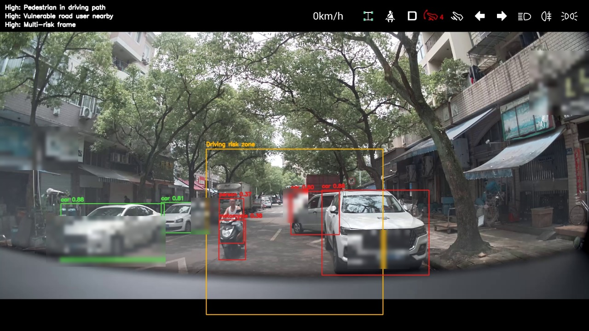

# YOLO 离线道路场景风险分析工具

基于 Python、OpenCV、YOLOv8 和 pandas 的离线道路视频分析工具。

项目面向道路场景测试流程：读取本地行车视频，按时间间隔抽帧，识别行人、车辆和交通控制目标，基于规则生成风险事件，并输出证据帧与结构化测试报告。



## 功能概览

- 使用 YOLOv8 对本地行车视频进行目标检测。
- 支持行人、车辆、骑行者、摩托车、公交车、卡车、交通灯和停止标志等目标类别。
- 基于预定义驾驶风险区域进行规则化风险判断。
- 支持行人进入驾驶路径、弱势交通参与者靠近、低能见度、密集车流、交通控制场景、大型车辆靠近和多风险叠加等事件类型。
- 自动保存带检测框和风险区域的证据帧。
- 可选生成带识别框和风险提示的新视频。
- 导出 CSV、Excel、JSON 和 HTML 报告。
- 提供 pytest 测试，覆盖风险规则和视频渲染逻辑。

## 快速开始

建议使用 Python 3.10 或更高版本。

```powershell
python -m venv .venv
.venv\Scripts\activate
python -m pip install -r requirements.txt
```

将本地视频放入 `data/raw/`，然后运行：

```powershell
python src/main.py --video data/raw/sample_drive.mp4 --output outputs/sample_drive
```

生成带识别框的新视频：

```powershell
python src/main.py --video data/raw/sample_drive.mp4 --render-video --render-stride 1 --output outputs/sample_drive
```

运行测试：

```powershell
python -m pytest tests
python -m compileall src tests
```

## 输出文件

运行完成后会在输出目录中生成：

- `outputs/<run>/event_log.csv`：风险事件明细。
- `outputs/<run>/risk_events.xlsx`：Excel 格式风险事件表。
- `outputs/<run>/summary.json`：统计摘要。
- `outputs/<run>/test_report.html`：HTML 测试报告。
- `outputs/<run>/annotated_frames/*.jpg`：证据帧截图。
- `outputs/<run>/annotated_video.mp4`：开启视频渲染时生成。

## 项目结构

```text
src/
  main.py
  detector.py
  risk_rules.py
  report_generator.py
  utils.py
  video_renderer.py
tests/
data/raw/
outputs/annotated_frames/
sample_images/
```

## 适用场景

- 离线道路视频目标检测。
- 测试人员快速定位道路场景风险片段。
- 生成带证据帧的道路场景测试记录。
- 作为更完整 ADAS 场景挖掘平台的基础检测模块。

## 限制说明

- YOLOv8n 是通用预训练模型，可能出现漏检或误检。
- 当前风险区域是几何近似，不等同于真实车道线识别或轨迹预测。

## 隐私说明

请不要上传原始行车视频、车牌、人脸、精确位置或渲染后的视频文件。`.gitignore` 已默认排除原始媒体、模型权重和生成结果。
